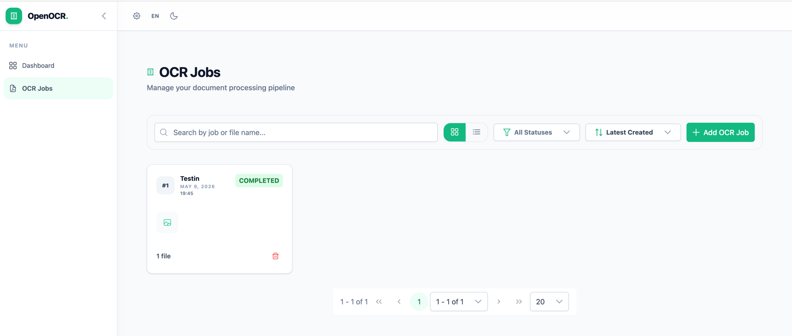
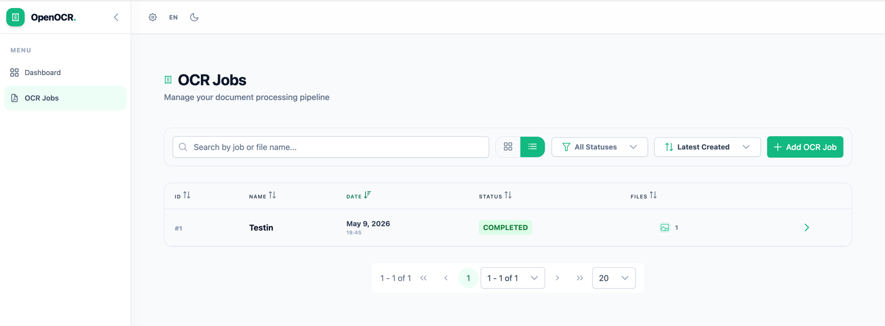

# Screenshots

A visual tour of the Open Receipt OCR interface.

---

## OCR Jobs — Card View

The main jobs listing in card view. Each card shows the job name, creation date, status badge, file thumbnails, and a delete button.

---

## OCR Jobs — Table View

The same listing switched to table view, showing sortable columns for ID, Name, Date, Status, and Files count.

---

## Job Detail — OCR Results

Clicking a job opens the detail panel. On the left, the uploaded file is previewed. On the right, the **Execution History** shows each OCR run and its status, and the **OCR Output Content** panel displays the structured text extracted from the receipt.

---

## Job Detail — Failed Execution

When an execution fails (e.g. an invalid API key), the **OCR Output Content** panel shows the error message returned by the provider. You can retry by clicking **Reprocess**.

---

## OCR & Output Settings

The settings dialog lets you choose a **default OCR provider** (local or cloud) and configure **output targets**. The selected provider is used automatically when uploading new jobs.

---

## 🌙 Dark Mode

The UI supports a dark theme that can be toggled from the top navigation bar. All pages, including the Dashboard, adapt automatically.

---

## 🌍 Localisation — French

The interface is fully translated into French (and other languages). Switch languages via the language toggle in the top bar.

---

*All screenshots taken from a locally running instance with Mistral OCR configured.*
