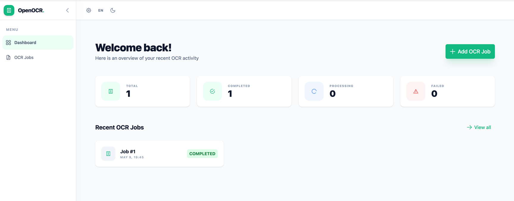
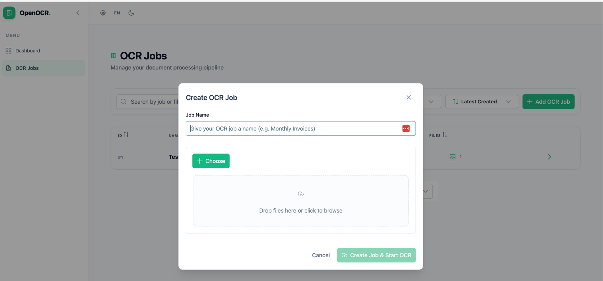
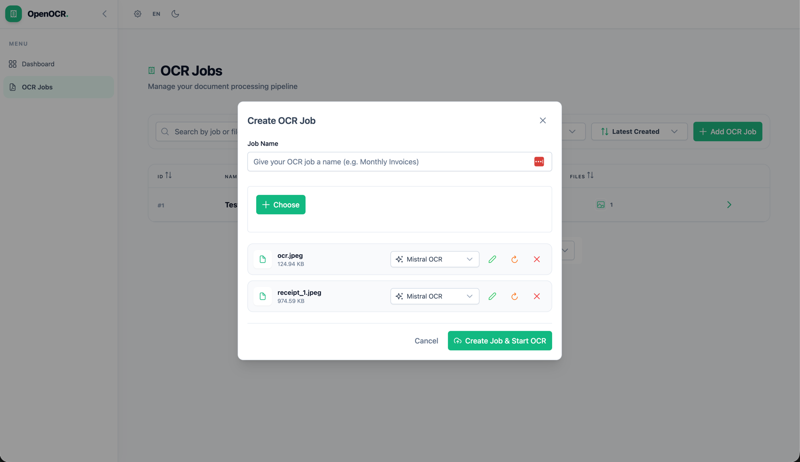
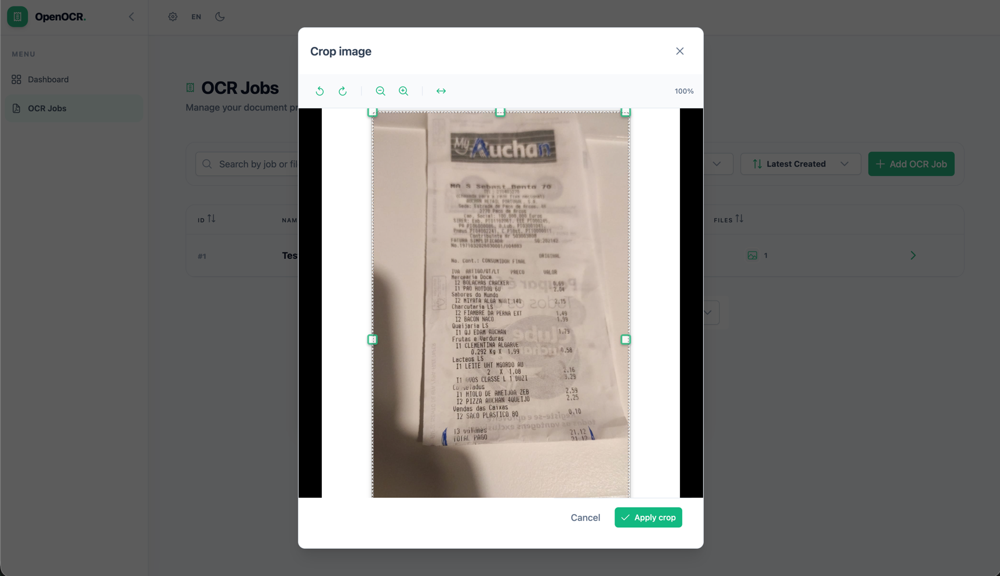
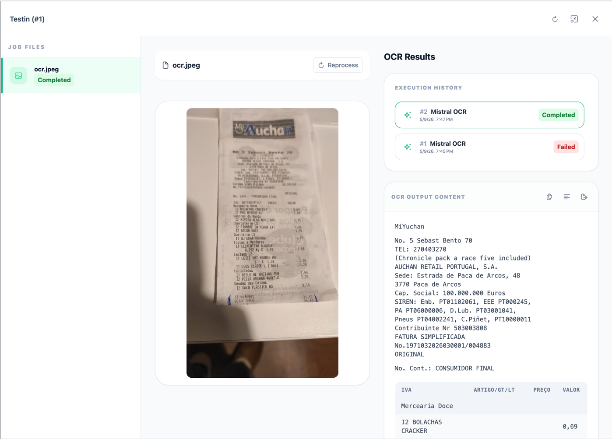
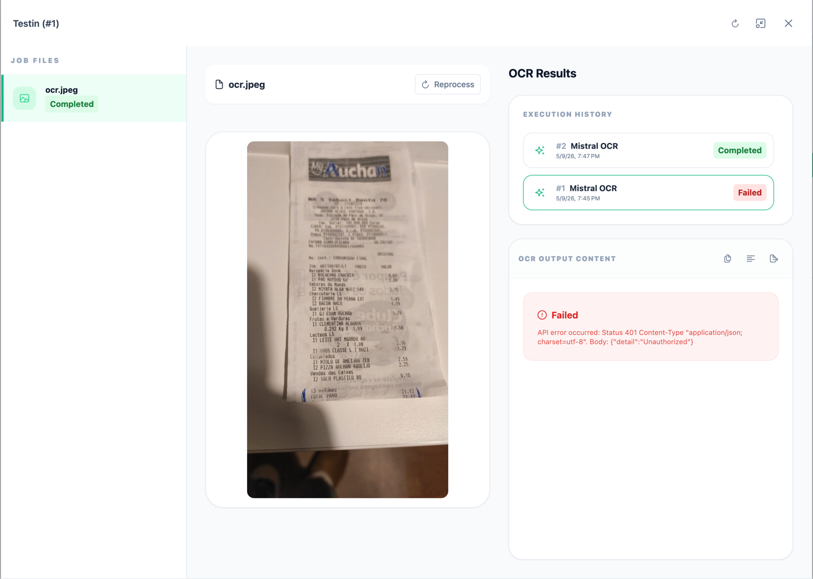
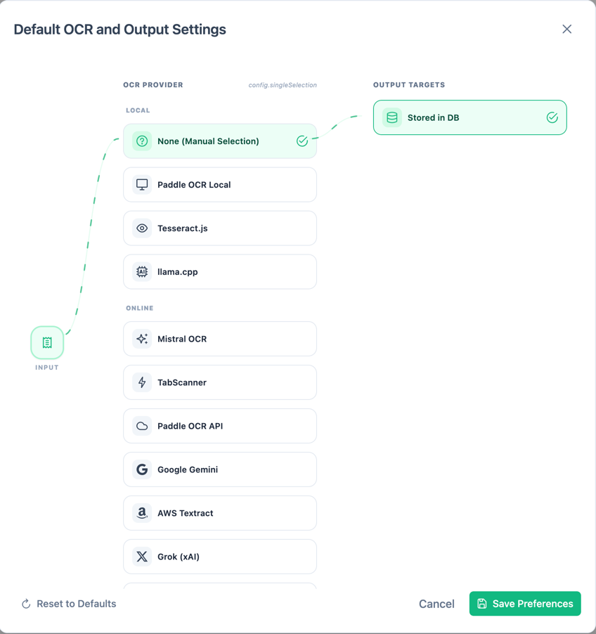
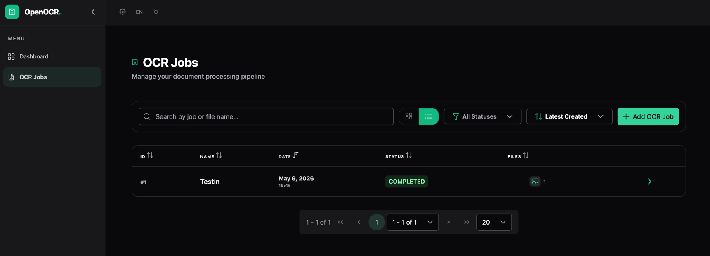
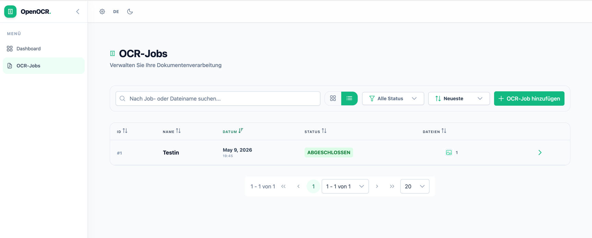

# Screenshots

A visual tour of the Open Receipt OCR interface.

---

## 🎥 Demo Video

<video src="assets/screenshots/open-receipt-ocr.mp4" controls width="100%"></video>

---

## Dashboard

The dashboard gives an at-a-glance summary of your OCR activity: total jobs, completed, processing, and failed counts, plus a list of recent jobs.

---

## OCR Jobs — Card View

The jobs listing in card view. Each card shows the job name, creation date, status badge, file thumbnails, and a delete button.

---

## OCR Jobs — Table View

The same listing switched to table view, showing sortable columns for ID, Name, Date, Status, and Files.

---

## Creating an OCR Job

Click **+ Add OCR Job** to open the creation dialog. Give the job a name, then choose one or more files to upload.

---

## Multiple Files per Job

A single job can process multiple files at once. Each file has its own OCR provider selector so you can mix providers within the same job.

---

## Image Crop

When uploading an image, an optional crop dialog lets you frame the receipt before sending it for OCR. Supports rotate, zoom, and flip controls.

---

## Job Detail — OCR Results

Clicking a job opens the detail panel. The receipt image is shown on the left. On the right, **Execution History** tracks every OCR run and the **OCR Output Content** panel displays the structured text extracted from the receipt.

---

## Job Detail — Failed Execution

When an execution fails (e.g. an invalid API key), the **OCR Output Content** panel shows the provider's error message. You can retry by clicking **Reprocess**.

---

## Default OCR & Output Settings

The settings dialog lets you pick a **default OCR provider** (local or cloud) and configure **output targets**. The selected provider is used automatically when uploading new jobs.

---

## 🌙 Dark Mode

The UI supports a dark theme toggled from the top navigation bar. All pages adapt automatically.

---

## 🌍 Localisation

The interface is fully localised. Switch languages via the language toggle in the top bar. Supported languages include English, Portuguese, French, and German.

---

*All screenshots taken from a locally running instance.*
